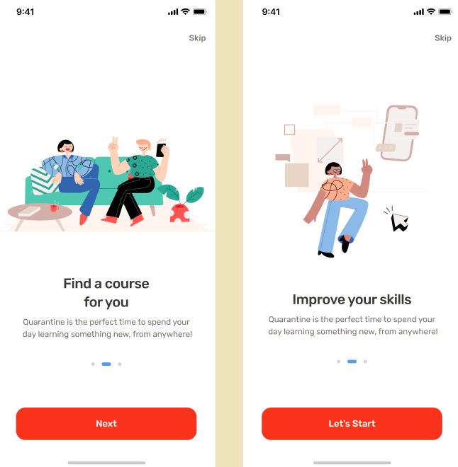
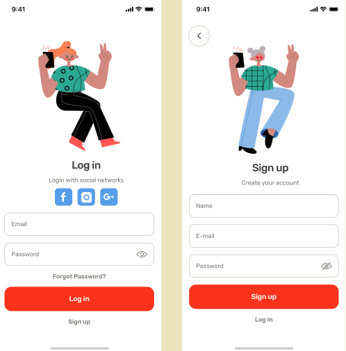
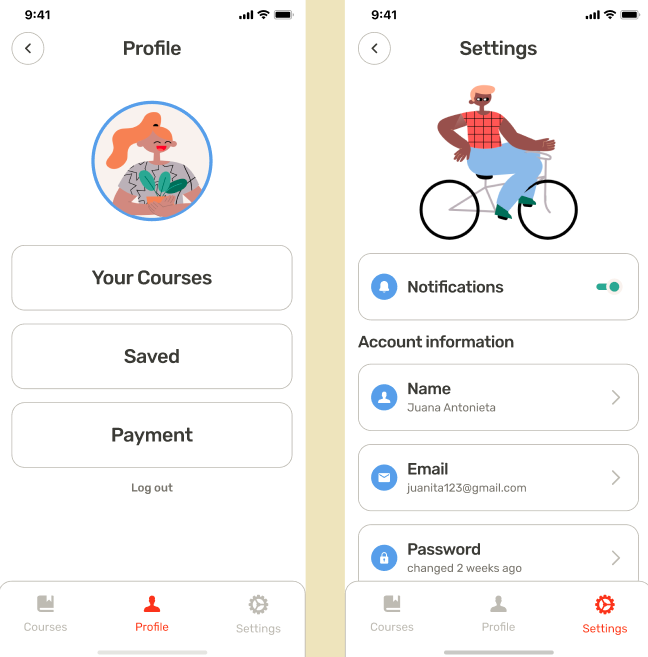
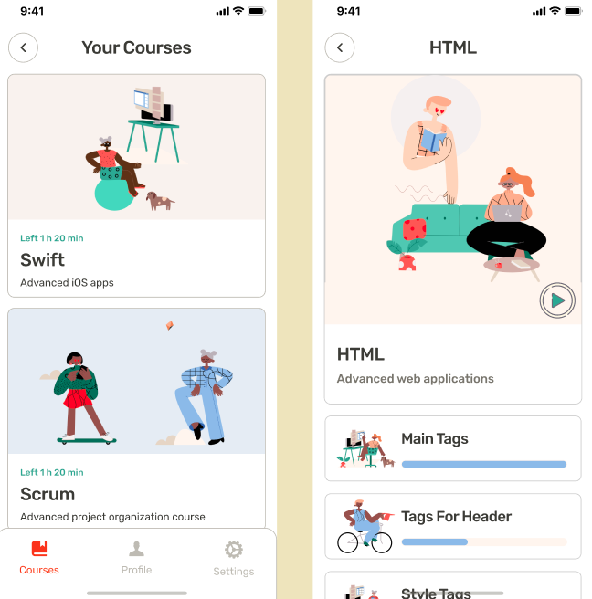
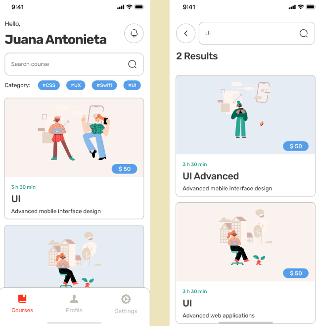
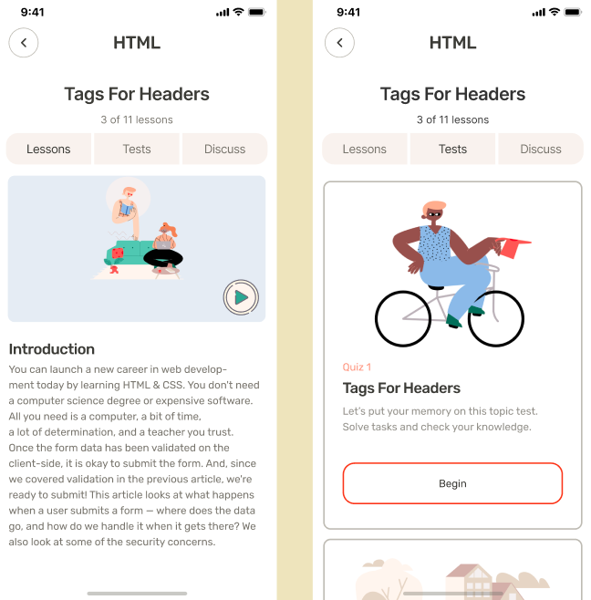
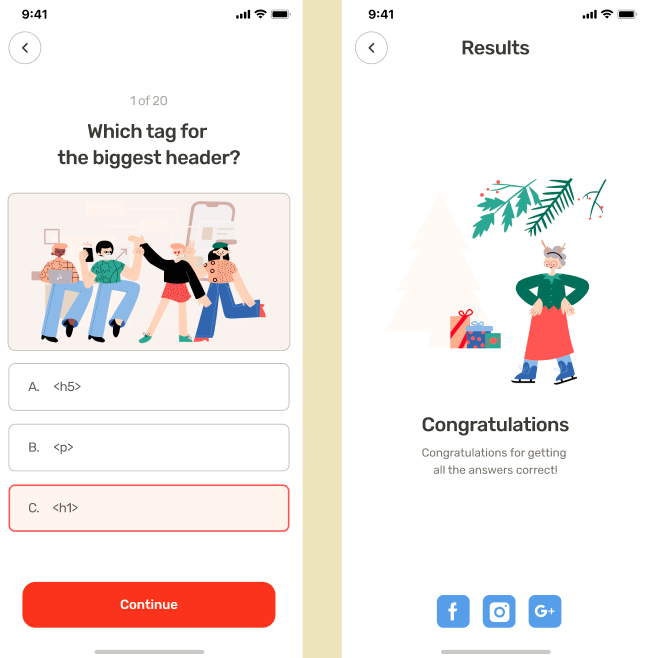
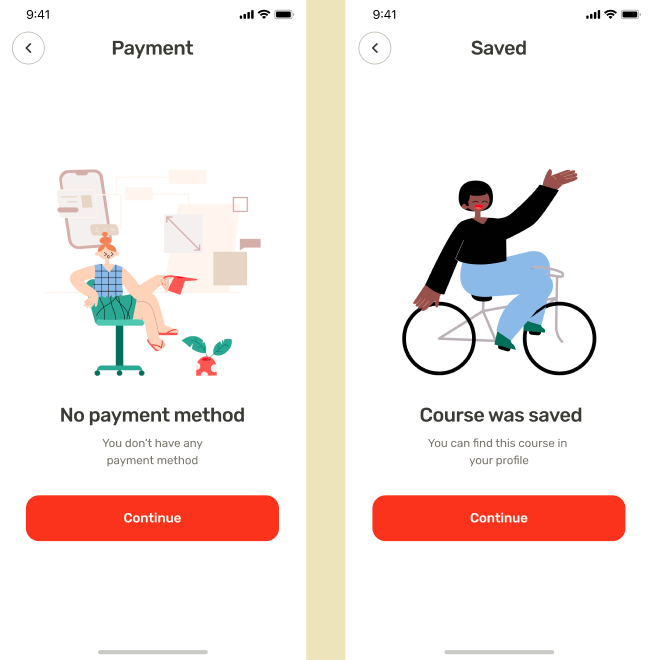
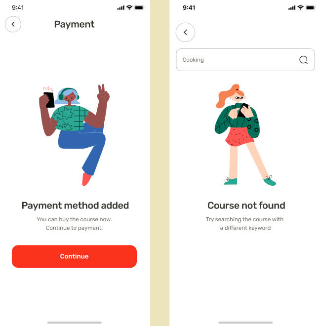

# E-Commerce Complate App - Flutter UI 

In the first four pages we will explain you about our Application. You will simply go to the Next pages by clicking the Next button. In the next pages we will ask you to enter your Email and Password or you can register via Social Networks. We go into our application and adjust the settings. You can change the screen via the Bottomnavigationbar. Now it's your turn to select Courses. Select the course and start learning. 

**Packages we are using:**

### Video Preview of Final UI

## Screens it contains:

=> Onboarding

=> Login

=> Forgot Password

=> Sign Up

=> Complete Profile

=> OTP Verification

=> Home Page

=> Product Details

=> Order

=> Profile (added)

=> Bottom Navigation Bar (added)

Now it contains all the screen, thanks for your love and support 🙏 

## Photos

